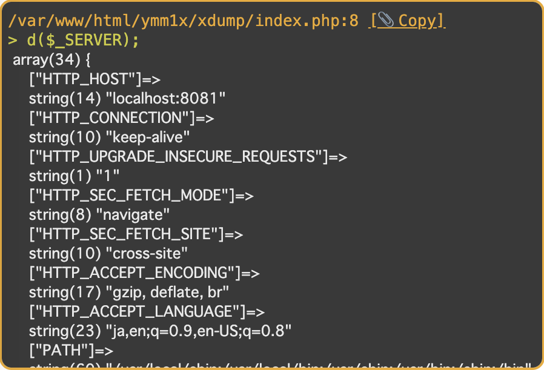

# xdump

A variable damper utility provides readability and flexibility instead of [var_dump\(\)](http://php.net/manual/function.var-dump.php).

- Shorthand function will be declared just by installing the package.
    - Example: `d($var1, $var2, $var3)`
- Decoration with HTML and CSS.
    - Decorations are deleted when the shell runs.
- The file name and line number of the dump source are also output together.

## Screen shot



## Installation

```sh
composer require ymm1x/xdump
```

## Usage

Variable-length arguments are supported.

### Shorthand

```php
d($var1, $var2, $var3);
```

### Longhand

```php
\Ymm1x\XDump\Dumper::dump($var1, $var2, $var3);
```

## License

This library is released under the [MIT license](LICENSE).
